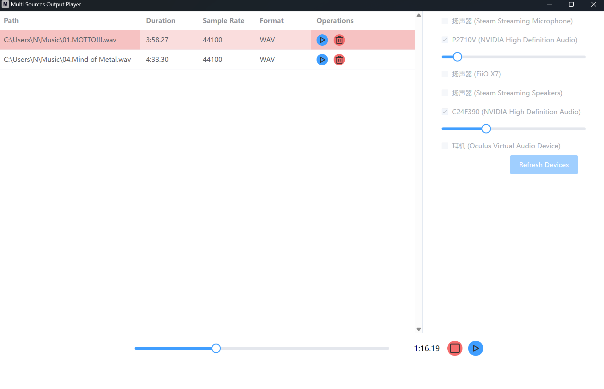

# 介绍

其他语言: [en](./readme.md)

在多个设备中同时播放音乐，以比较不同的设备

## 怎么使用

1. 通过`.msi`进行安装

2. 拖拽音乐文件到窗口里(只有`.mp3`和`.wav`完全支持)，建议使用类似foobar2000等软件进行转换先

3. 选择1个或多个输出设备

4. 点击列表中最后的播放按钮

5. 你可以随时更改设备的输出音量

## 未来要增加的特性

1. 保存/加载播放列表

2. 显示更多的元数据

3. 优化UI

4. 在别的平台尝试

## 开发

这个项目是由`Tauri`开发的，

使用以下命令进行开发(要先行安装`Tauri`需求):

1. `pnpm i`

2. `pnpm tauri dev`